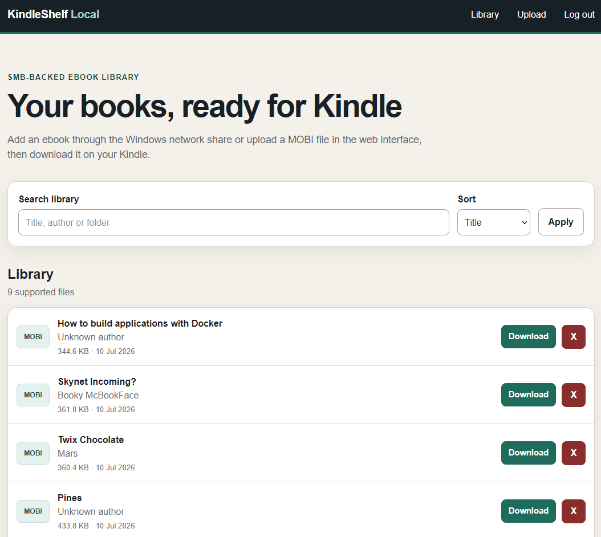

<!-- version 3 -->
<p align="center">
  
</p>

# KindleShelf Local

A private, Docker-hosted ebook library designed for the Kindle built-in browser. KindleShelf scans an SMB-backed folder and converts DRM-free ebooks to Kindle-compatible MOBI files using Calibre.

<details> <summary><strong>Screenshot</strong></summary> <br> <p align="center"> <a href="screenshot.png">  </a> </p> </details>

## Features

- Live recursive scan of an ebook folder
- Windows SMB share at `\\SERVER-IP\KindleShelf`
- Kindle-friendly single-column interface
- Search and sorting
- On-demand EPUB/AZW3/DOCX/FB2/HTML/ODT/RTF/PDF to MOBI conversion
- Persistent conversion cache
- Optional application PIN
- Web upload page for DRM-free MOBI files
- Removal of library items from the web interface
- Confirmation page and CSRF protection for deletions
- Configurable upload-size limit
- Health endpoint for Docker and reverse-proxy monitoring

## Supported source formats

AZW, AZW3, DOCX, EPUB, FB2, HTM, HTML, MOBI, ODT, PDF, PRC, RTF and TXT.

Only DRM-free files can be converted. This project does not remove or bypass DRM.

## Uploading MOBI files

Select **Upload** in the navigation bar, choose a `.mobi` file and select **Upload to Library**. Uploaded files are validated, sanitised and stored in the same `library/` folder used by the SMB share.

The maximum upload size defaults to 100 MB and can be changed in `.env`:

```env
# version 1
MAX_UPLOAD_SIZE_MB=100
```

If an uploaded filename already exists, KindleShelf adds a number such as `Book (2).mobi` instead of overwriting the existing file.

## Install

```bash
# version 1
mkdir -p ~/docker
cd ~/docker
git clone https://github.com/YOUR-USERNAME/kindleshelf-local.git kindleshelf
cd kindleshelf
cp .env.example .env
nano .env
docker compose up -d --build
```

Generate a secure application secret:

```bash
# version 1
openssl rand -hex 32
```

Place the result in `.env` as `SECRET_KEY`.

Open the application at:

```text
http://YOUR-UBUNTU-IP:8112
```

## Windows SMB share

Open this path in Windows File Explorer:

```text
\\YOUR-UBUNTU-IP\KindleShelf
```

Use the `SMB_USER` and `SMB_PASSWORD` values from `.env`.

The Samba container uses the same `PUID` and `PGID` as the web application. This allows files added through Windows to be removed from the KindleShelf interface.

## Removing books

Each library row has an **X** button. Selecting it opens a confirmation page. Confirming removal permanently deletes the source ebook from the shared `library/` folder and removes its generated MOBI cache, if one exists.

Deletion cannot be undone by KindleShelf. Restore a file from your own backup if it was removed accidentally.

## NGINX Proxy Manager

Create a Proxy Host with:

- **Domain Names:** your chosen domain
- **Scheme:** `http`
- **Forward Hostname/IP:** Ubuntu server IP
- **Forward Port:** `8112`
- **Cache Assets:** disabled
- **Block Common Exploits:** enabled
- **Websockets Support:** not required
- **SSL:** select or request your certificate and enable Force SSL

After confirming HTTPS works, change this value in `.env`:

```env
# version 1
SESSION_COOKIE_SECURE=true
```

Apply the change:

```bash
# version 1
docker compose up -d
```

Keep the site restricted to your home LAN, VPN, or a trusted NGINX Proxy Manager Access List. The application has permission to delete files from its library.

## Kindle workflow

1. Add a DRM-free ebook through the Windows SMB share, or upload a `.mobi` file from the **Upload** page.
2. Open KindleShelf in the Kindle browser.
3. Search for the book if needed.
4. Select **Kindle MOBI**.
5. Accept the Kindle download prompt.
6. Use the **X** button later to remove the source ebook from the shared library.

## File permissions

Set `PUID` and `PGID` in `.env` to the UID and GID of the Ubuntu account that owns the project folders.

Check the current account values with:

```bash
# version 1
id -u
id -g
```

If existing library files have different ownership, correct them from the project directory:

```bash
# version 1
sudo chown -R "$(id -u):$(id -g)" library data
```

## Updating an existing installation

Back up your current files first:

```bash
# version 1
cd ~/docker/kindleshelf
cp .env ../kindleshelf.env.backup
cp -a library ../kindleshelf-library-backup
```

Replace the application files with this release while retaining your `.env`, `library/`, and `data/` directories. Then rebuild:

```bash
# version 1
cd ~/docker/kindleshelf
docker compose down
docker compose up -d --build
docker compose ps
```

The `library` mount is now read/write. The transfer-code environment values from v1.0.0 are no longer used and can be removed from `.env`.

## Logs and health

```bash
# version 1
docker compose logs -f kindleshelf
docker compose logs -f samba
curl http://127.0.0.1:8112/health
```

A healthy response includes `library_writable: true` when the configured permissions allow deletion.

## Backup

Back up:

- `library/` — source ebooks
- `data/` — generated MOBI conversion cache

The conversion cache can be deleted safely while the application is stopped. It will be regenerated as needed.

## Licence

MIT

## Upload troubleshooting

### Invalid request when using the server IP over HTTP

When you need both `http://SERVER-IP:8112` and the HTTPS NGINX Proxy Manager domain, use:

```env
# version 1
SESSION_COOKIE_SECURE=false
```

A secure cookie is intentionally not sent over plain HTTP. Set this to `true` only when the application will be accessed exclusively through HTTPS. After changing the value, recreate the container and refresh the Upload page before submitting again.

### Invalid cross-device link

Version 1.2.2 fixes this. Docker mounts `/data` and `/library` as separate filesystems, so Linux cannot rename an upload directly between them. KindleShelf now copies the validated upload into a staging file within `/library`, then performs the final atomic rename on the same filesystem.
